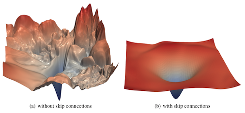
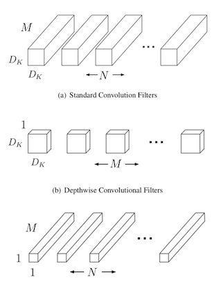
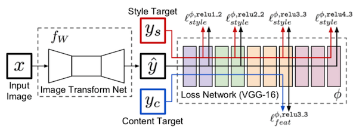

# Deep Learning Papers

The papers are listed from newer to older based on the first publication date.

## 2017

### [Searching for Activation Functions](https://arxiv.org/abs/1710.05941.pdf)

read: | last edition: 2017

The authors discovered (using a random search with RNN controller) a new activation function that
seems to show a better behavior than ReLU activation. The new function is called _Swish_. The 
analytical formula:

```python
def swish(x):
    return x * sigmoid(beta * x)
```

The _beta_ is a trainable parameter. The new activation function could be treated as a non-linear
interpolation between linear activation and ReLU. (Try to set `beta=0` and `beta=inf` to see why).

### [Visualizing the Loss Landscape of Neural Nets (Hao et al.)](https://arxiv.org/pdf/1712.09913.pdf)

read: ✅ | last edition: 2018
  
The authors visually explain positive effect of skip-connections and wider layers 
in ResNets, as well as properly selected parameters. The is also [a repository](https://github.com/tomgoldstein/loss-landscape) 
with implementation of author's approach. (CLI tool visualizing pre-trained VGG, ResNet and DenseNet 
architectures).

> **Note:** The tool seems to be not too flexible. It is not a library or package that one could 
easily install and drop an instance of pre-trained model into visualizing method. However, it 
should possible to use models different from the models provided by authors.



### [MobileNets: Efficient Convolutional Neural Networks for Mobile Vision Applications (Howard et al.)](https://arxiv.org/pdf/1704.04861.pdf)

read: ✅ | last edition: 2017

The authors use depthwise separable convolutions to reduce the number of parameters in the network with only a small
decrease in the quality of predictions. 

     

 
### [Exploring Loss Function Topology with Cyclical Learning Rates (Smith L. N., Topin N.)](https://arxiv.org/pdf/1702.04283.pdf)

read: ✅ | last edition: 2017

The authors discovered a _superconvergence phenomena_ while training residual networks.
Also includes an interesting section about linear interpolation between weights of two networks to
estimate if they converged to the same optimal value.
 
A short paper of 4 pages in total.

> **Quote:** We coin the term **“super-convergence”** to refer to this phenomenon where a network is 
trained to a better final test accuracy compared to traditional training, but with fewer iterations 
and a much larger learning rate.

## 2016

### [UMDFaces: An Annotated Face Dataset for Training Deep Networks (Bansal et al.)](https://arxiv.org/pdf/1611.01484v2.pdf)

read: ✅ | last edition: 2017

Describes [a dataset](http://umdfaces.io) with faces and their annotations (including bounding boxes and facial keypoints). 
The dataset includes 367,888 images of 8,277 subjects in total. The authors validate quality of their dataset 
by training a [VGG-face](https://www.robots.ox.ac.uk/~vgg/publications/2015/Parkhi15/parkhi15.pdf) model and comparing
results with AFLW dataset models.    

### [Perceptual Losses for Real-Time Style Transfer and Super-Resolution](https://arxiv.org/pdf/1603.08155.pdf)

read: ⏳ | last edition: 2016

Using VGG16 model as a loss function on top of image-to-image ResNet model to build with a higher
perceptual attractiveness then when using pixes-wise distance measure.



### [A guide to convolution arithmetic for deep learning (Dumoulin V., Visin F.)](https://arxiv.org/pdf/1603.07285.pdf)

read: ✅ | last edition: 2018

A comprehensive guide on convolutions arithmetic. Includes lots of formulas computing number of 
output feature maps depending on input size, kernel size, stride, and padding. The guide helps 
to understand how to pick parameters to reduce/keep/increase the size of output for a specific 
(de)convolution/pooling layer.

The authors include [the link to the repository](https://github.com/vdumoulin/conv_arithmetic) with 
scripts to generate schematic animations of (de)convolution operations.  


### 

## 2015

### [Cyclical learning rates for training neural networks (Smith L. N.)](https://arxiv.org/pdf/1702.04283.pdf)

read: ✅ | last edition: 2017

An empirical observation of Circular Learning Rates (CLR) effectiveness on CIFAR-10 and CIFAR-100 datasets. 
Using triangular and exponential learning rate schedulers to improve training convergence speed. 
The author also talks about estimating a good value for the cycle length and `lr_min`/`lr_max` 
boundaries with "LR range test"; run your model for several epochs while letting the learning 
rate increase linearly between low and high LR values.


### [Learning Deconvolution Network for Semantic Segmentation](https://www.cv-foundation.org/openaccess/content_iccv_2015/papers/Noh_Learning_Deconvolution_Network_ICCV_2015_paper.pdf)

read: ✅

Uses VGG16 + "mirrored" VGG16 (deconvolutions and unpooling) to predict segmentation masks on
PASCAL VOC 2012 dataset. The major limitation of the author's approach is two-stage training process.
At first, the model is trained on cropped single-class examples. Then, on the second stage, the authors
generate a list of "proposals" from the input image using [edge box technique](https://pdollar.github.io/files/papers/ZitnickDollarECCV14edgeBoxes.pdf),
pass each proposal into their model, and then reconstruct a segmentation mask.

It is not an end-to-end solution and requires some additional preparation of training set and generating
list of proposals for each input image before the inference. However, the paper is worth to check to 
get some insights about image-to-image architectures.


### [Delving Deep into Rectifiers: Surpassing Human-Level Performance on ImageNet Classification](https://arxiv.org/pdf/1502.01852.pdf)

read: ✅ | last edition: 2015

The paper continues work started in the [Glorot and Bengio paper](http://proceedings.mlr.press/v9/glorot10a/glorot10a.pdf).
([A post](https://prateekvjoshi.com/2016/03/29/understanding-xavier-initialization-in-deep-neural-networks/) about 
intuition behind Xavier's initialization). The authors propose a better way to initialize weights for ReLU activations. 
They take into account the properties of that activation function and also propose _PReLU_ - an improved version of 
ReLU with trainable negative slope parameter. Also, the authors mention that "leaky" ReLU activations don't show too
much improvement over "standard" ReLU but their activation does a better job.  

A quote about initialization (Section 2.2):
> Rectifier networks are easier to train compared with traditional sigmoid-like activation networks.
> But a bad initialization can still hamper the learning of a highly non-linear system.

## Not sorted

1. [Super-Convergence: Very Fast Training of Neural Networks Using Large Learning Rates (Smith L. N., Topin N.)](https://arxiv.org/abs/1708.07120)
2. [A disciplined approach to neural network hyper-parameters: Part 1 -- learning rate, batch size, momentum, and weight decay (Smith L. N.)](https://arxiv.org/abs/1803.09820)